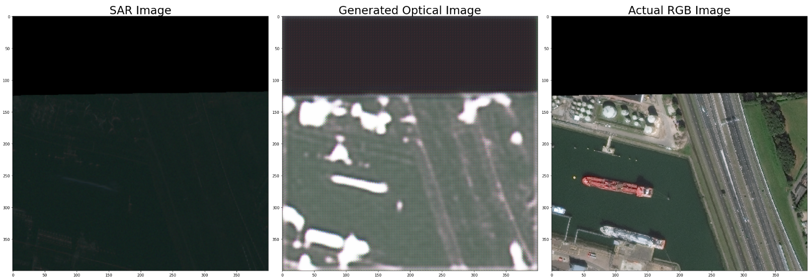
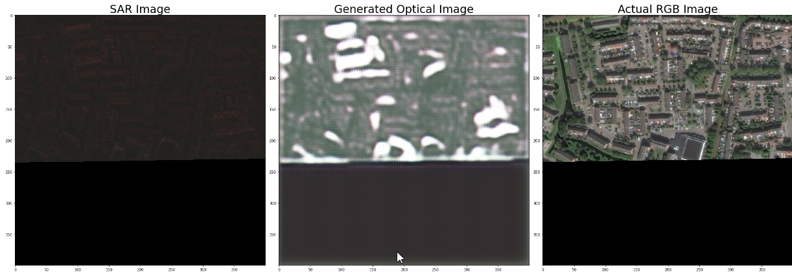
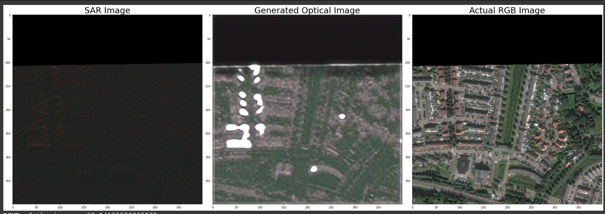
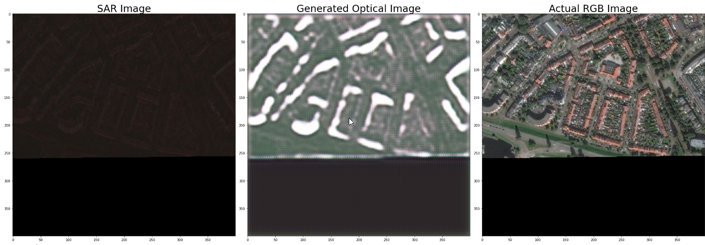
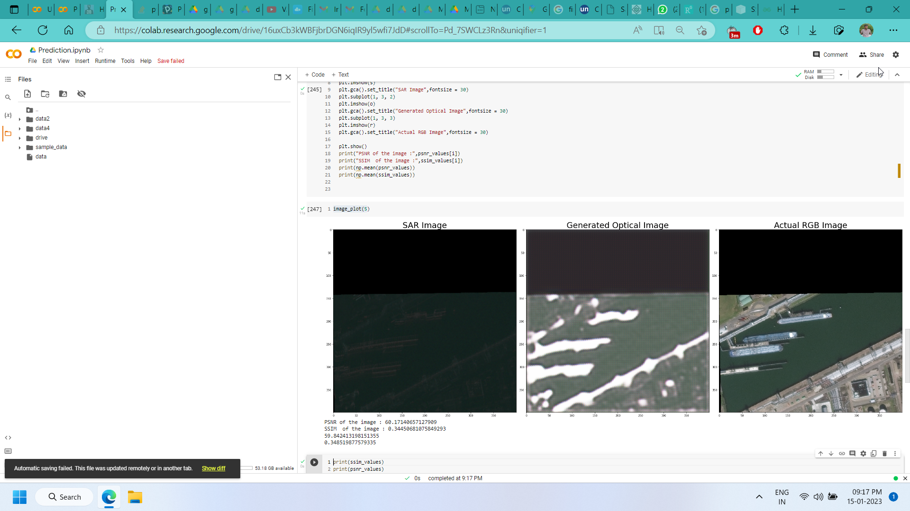

# PS-1-CycleGAN

## SAR-to-RGB-CycleGAN

This repository contains the implementation of a Cycle Generative Adversarial Network (CycleGAN) model for converting Synthetic Aperture Radar (SAR) satellite imagery to Photorealistic-RGB (PS-RGB) optical images.


### Downloading the dataset:
#### Prerequisites:
- AWS Account (create one if you dont have one)
- Install awscli (Run this on bash/terminal depending on your OS)
```
pip install awscli
```
#### Procedure
- Create a data folder, inside which,Cceate 2 new directories SAR-Intensity & PS-RGB(optical images)

In SAR-Intensity folder execute:
```
aws s3 sync s3://spacenet-dataset/spacenet/SN6_buildings/train/AOI_11_Rotterdam . --exclude "*" --include "SAR-Intensity/*"
```
In PS-RGB folder execute:
```
aws s3 sync s3://spacenet-dataset/spacenet/SN6_buildings/train/AOI_11_Rotterdam . --exclude "*" --include "PS-RGB/*"
```


## Presentation:
[Link](https://pitch.com/public/07bf3b30-13b5-4e41-a50e-73ec3ee042ed)


##  Notebook Links


### Final Approach

[Notebook](./Notebooks/Final-Approach.ipynb)

[Colab](https://colab.research.google.com/drive/16uxCb3kWBFjbrDGN6iqIR9yl5wfi7JdD?usp=sharing)

#### Image prediction

- [Colab](https://colab.research.google.com/drive/16uxCb3kWBFjbrDGN6iqIR9yl5wfi7JdD?usp=sharing)

#### Initial Analysis

- [Colab](https://colab.research.google.com/drive/1WWUBCR1jre3hP1NDSKRpjaihsUIJJRAv?usp=sharing)

- [Notebook](./Notebooks/Initial-Analysis.ipynb)

#### Alternative Approach

- [Notebook](./Notebooks/Alternative-Approach.ipynb)

#### Other resources on drive
- [Model]()

## Model and 5 images (as asked for results)







---
<p align="center">Made with ❤️ and 💻</p>
