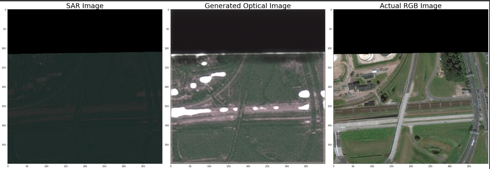
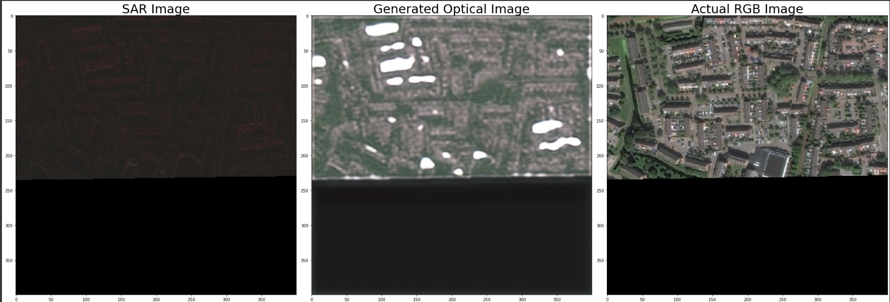
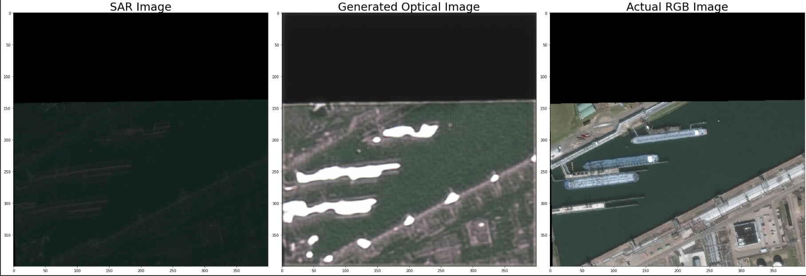

# Problem Statement- 1] NEURAL STYLE TRANSFER

## SAR-to-RGB-CycleGAN 🎆

This repository contains the implementation of a Cycle Generative Adversarial Network (CycleGAN) model for converting Synthetic Aperture Radar (SAR) satellite imagery to Photorealistic-RGB (PS-RGB) optical images.


### Downloading the dataset: 💽
#### Prerequisites:
- AWS Account (create one if you dont have one)
- Install awscli (Run this on bash/terminal depending on your OS)
```
pip install awscli
```
#### Procedure 🚲
- Create a data folder, inside which,Cceate 2 new directories SAR-Intensity & PS-RGB(optical images)

In SAR-Intensity folder execute:
```
aws s3 sync s3://spacenet-dataset/spacenet/SN6_buildings/train/AOI_11_Rotterdam . --exclude "*" --include "SAR-Intensity/*"
```
In PS-RGB folder execute:
```
aws s3 sync s3://spacenet-dataset/spacenet/SN6_buildings/train/AOI_11_Rotterdam . --exclude "*" --include "PS-RGB/*"
```


## Presentation: 🎬
[Link](https://pitch.com/public/07bf3b30-13b5-4e41-a50e-73ec3ee042ed)


##  Notebook Links 📙


### Data Preprocessing and Model Training

- [Notebook](./Notebooks/Final-Approach.ipynb)

- [Colab](https://colab.research.google.com/drive/16uxCb3kWBFjbrDGN6iqIR9yl5wfi7JdD?usp=sharing)

#### Generating Optical Images with Trained Model

- [Colab](https://colab.research.google.com/drive/16uxCb3kWBFjbrDGN6iqIR9yl5wfi7JdD?usp=sharing)


#### Other resources on drive 🚗
- [Model](https://drive.google.com/file/d/1-DwuJozH5IEV-D9i2EgbWrN-ORqZEH17/view?usp=sharing)

## Generated Samples (5 images as mentioned) 📸



PSNR=60.79705779790465

SSIM=0.2975623679184651


PSNR=59.3106434404258

SSIM=0.4091230821243453


PSNR=60.309672567463785

SSIM=0.2534892068709377



PSNR=60.243534936049066

SSIM=0.34455954516037757



PSNR=60.17140657127909

SSIM=0.34450681075849293


---
<p align="center">Made with ❤️ and 💻</p>
